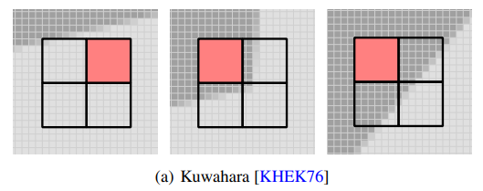
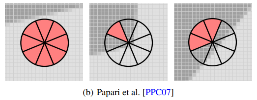
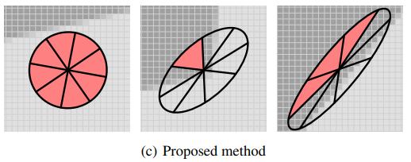

# Project Final Report
{: .no_toc }

## Table of Contents

{: .no_toc .text-delta }
- TOC
{:toc}

## Abstract

In this project we used shader programming to implement a variety of 2D filtering effects, which we were able to use to render stylized images and videos. We implemented both the Kuwahara and Voronoi filters, each of which has 3 distinct variants.

## Technical Approach

### Kuwahara Square

### Kuwahara Circle

The circle variant of the Kuwahara filter utilizes a circular shaped kernel instead of a square, based on the technique described by Papari et al. (2007). Additionally, we split the circle into 8 different slices instead of the 4 square quadrants. The motivation behind this technique is that by using a circular kernel and more splits, we can more accurately capture edges in the input image and output less block-shaped artifacts.

Our implementation of the filter is mainly based on the technique described in Kyprianidis et al. (2010), where a polynomial function is used to approximate the Gaussian kernel used when computing the weights in each kernel. By using a polynomial function to approximate the expensive Gaussian, performance is improved significantly. The polynomial function is like so: $$[(x+\zeta) + \eta y^2]^2$$. The value $\zeta$ controls how much the sectors overlap at the filter origin (center pixel in the kernel) and $\eta$ controls how much the sectors overlap at their boundaries. We set our $\zeta$ and $\eta$ values based on recommendations in Kyprianidis et al., which allowed us to approximate the Gaussian.

The most challenging part when implementing this filter is reading and understanding the technique proposed by Kyprianidis et al., especially the mathematics in the paper. Thankfully Acerola’s Youtube video covering the Kuwahara filter helped greatly with the explanations.

### Kuwahara Anisotropic

### Voronoi Filter

A Voronoi diagram is defined by a set of seed vertices in a 2D space. When applied to an image as a filter, we take each pixel in the output image and set it to be the same color as the nearest seed vertex.

The naive implementation of the Voronoi filters is basically a brute-force solution. When loading the shader programs on the CPU, we also use numpy to instantiate an array of randomly generated coordinates in texel (uv space), which we then pass as an uniform to the fragment shader. These random coordinates will serve as the seed vertices for the Voronoi filter. In the fragment shader, we loop through each of these seed vertices and find the closest one to our input texcoord based on one of the three distance metrics (Euclidean, Manhattan, and Chebyshev). Then we simply set the output color of the fragment shader to that color sampled from the chosen seed coordinate. This approach is simple and with the help of the GPU, the speed is not bad as well, despite being brute-force.

This approach, while simple, has a big drawback. The amount of seed vertices we are able to pass in as a uniform is hard capped at around 1024. This is simply not a large number of seed vertices, especially if we want our input images to still be recognizable after applying the filter. After some investigating, it turns out OpenGL allows you to pass in uniforms through a buffer when the shader program is instantiated. This buffer allows us to store more data than an uniform array as well, up to 4096 seed vertices. The results from this are slightly more acceptable, but still not very good. Additionally, this still has the same issue with the naive approach, which is that the array size of the passed-in uniforms has to be hardcoded to the same value in both the python driver program and the fragment shaders. That is why we adopted a new approach that did not require us to pass in seed vertices as uniforms.

This new method exploits two key features of OpenGL: instance rendering and the depth buffer. Instance rendering is when we render the same object multiple times, with a different instance variable every time. The depth buffer is used in a depth test to ultimately determine which color will be shown on the screen. Once again we need to instantiate an N-sized array of seed vertices. However, this time we also render N instances of the same quad, each time passing a different seed vertex. We write the distance between input texcoord and seed vertex to the depth buffer and set the output color to the seed vertex. At the very end, the GPU will decide for us what colors need to be rendered based on the depth test. Texcoords will have a large distance from a far-away seed vertex, hence a large depth value and be discarded by the depth test. This technique is inspired from a blog post authored by Nicholas McDonald, where he explains how the depth buffer can be used for generating Voronoi diagrams.

While this new method allows a greatly increased number of seed vertices (I’ve tried up to 2^16 inputs), there is a significant performance trade-off. There are lots of wasted fragments discarded by the depth test. This is slightly improved by defining a variable R that represents some distance in texel space, and calling discard in the fragment shader for distances that exceed this R value.

Overall, implementing the Voronoi filter was very challenging, but yielded satisfying results. We explored and experimented with different features of OpenGL to leverage in our rendering.

### Rendering Pipeline and GUI

Our program is set up in `python`, using the `moderngl` and `moderngl-window` packages to execute our shader program and render outputs. In order to incorporate the input images into the graphics pipeline, we loaded as textures into the program.

## Video

Video Link Here

## Presentation

Presentation Link Here
