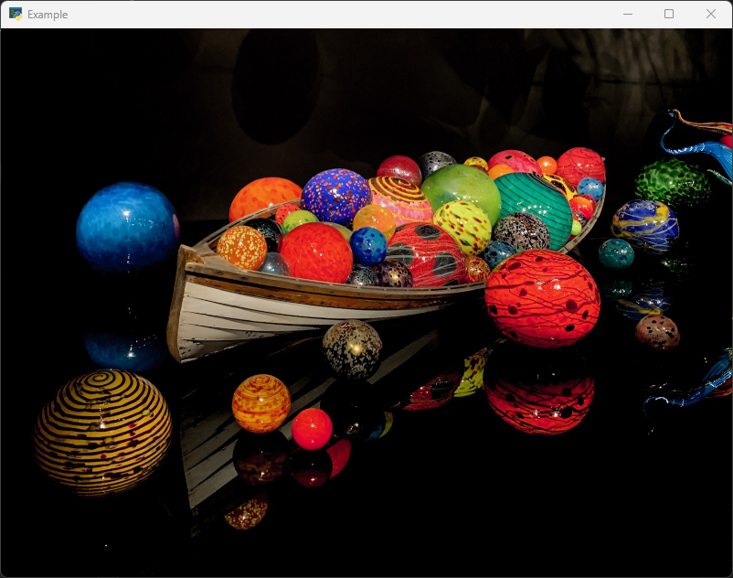
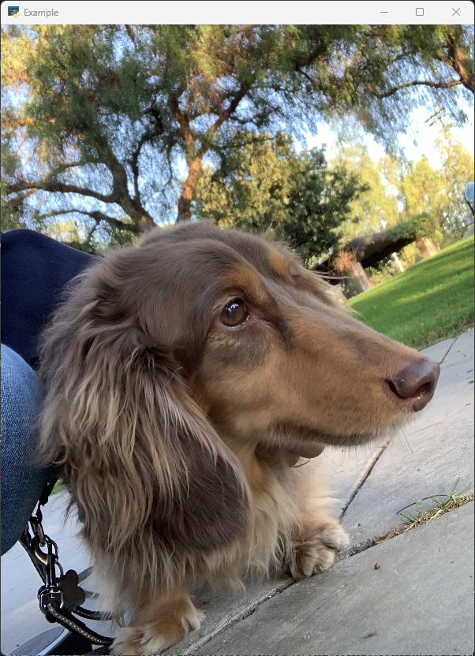
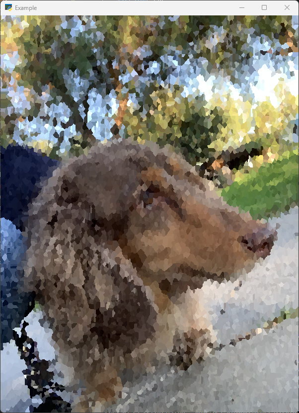

# Project Final Report
{: .no_toc }

## Table of Contents
{: .no_toc .text-delta }

- TOC
{:toc}

## Abstract

In this project, we created a software platform for rendering images and videos with a variety of 2D filtering effects designed to mimic a non-photorealistic, painterly appearance. Specifically, we implement 3 variants of both the Kuwahara and Voronoi filters to showcase a broad range of painterly rendering post-processing filters.

The Kuwahara filter was originally proposed by Michiyoshi Kuwahara, Ph.D. as a denoising filter in the 1970s. However, this filter was found to generate very nice painterly renderings, too. Over time, many improvements have been made to the original filter, so we showcase the square, circle, and anisotropic variants.

A Voronoi diagram is defined by a set of seed vertices in a 2D space. When applied to an image as a filter, each pixel is taken in the output image and set to be the same color as the nearest seed vertex. We can use different distance metrics in the computation to achieve a variety of different effects. We utilize an alternative to generating stylized images and videos without manually painting and animating every frame through shader programming. We showcase the Euclidean, Manhattan, and Chebyshev variants.

## Technical Approach

### Rendering Pipeline and GUI

For the Python frontend, we predominantly used the `moderngl-window` Python library to process both image and video inputs through the rendering pipeline. With the help of a YouTube video explaining how to apply a filter to an image and an example file on the official `moderngl-window` GitHub repository for playing back videos, we were able to start with the rendering pipeline already created. With this basic infrastructure, we could now input images and videos and render them with default texture sampling with GLSL shader programs.

To improve upon the rendering pipeline, we added command line arguments to parameterize the rendering from the Python files. Additionally, we added keyboard shortcuts to change the `kernel_size` uniform argument to the GLSL shader programs. Both of these features are highly customizable and easy to improve upon.

The majority of our work was spent on the design and development of the following GLSL shader files, where we could just load them into the `moderngl-window` rendering pipeline to see how the filters looked on images and videos of our choice.

### Kuwahara Square

The square variant of the Kuwahara filter utilizes a square kernel to analyze the surrounding texture pixels to determine each pixel’s color. Surrounding pixels are split into 4 quadrants with dimensions `kernel_size x kernel_size`. Some surrounding pixels are part of multiple quadrants. The pixel we are computing the color for is the center pixel.

For each quadrant, we compute the mean color and color variance from the image or video texture. Color is represented by illuminance: `illum(R, G, B, W) = 0.2126 * R + 0.7152 * G + 0.0722 * B`. The illuminance mean and variance are computed using `s_1`, `s_2`, and `kernel_size`:

$$s_1=\sum^{n}_{k=1}{x_k}$$

$$s_1=\sum^{n}_{k=1}{x^{2}_{k}}$$

$$\mu = \frac{s_1}{n}$$

$$\sigma^2=\frac{1}{n-1} \cdot \left( s_2 - \frac{s_1^2}{n} \right)$$

Once all mean and variance values are calculated, the mean color from the quadrant with the smallest color variance is used as the color for the pixel. This operation is done on all pixels in a texture.

This works as an edge preserving algorithm because largely homogenous areas are blurred while details are still preserved.

The square variant is the original version of the Kuwahara developed by Kuwahara himself. This served as our baseline. Due to how common this implementation is, we did not need to reference any papers and instead could use a simple internet search for implementation details.

As this was the first filter implemented, we ran into strange issues involving image rendering glitching out. This was solved through setting the `vec4` and `mat4` values to 0 in the beginning. We learned the importance of proper variable initialization in GLSL.

### Kuwahara Circle

The circle variant of the Kuwahara filter utilizes a circular shaped kernel instead of a square and splits the circle into 8 different slices, based on the technique described by Papari et al. (2007). The motivation behind this technique is that by using a circular kernel and more splits, we can more accurately capture edges in the input image and output less block-shaped artifacts.

Our implementation of the filter is mainly based on the technique described in Kyprianidis et al. (2010), where a polynomial function is used to approximate the Gaussian kernel used when computing the weights in each kernel. By using a polynomial function to approximate the expensive Gaussian, performance is improved significantly. The polynomial function is like so:

$$[(x+\zeta) + \eta y^2]^2$$

The value $$\zeta$$ controls how much the sectors overlap at the filter origin (center pixel in the kernel) and $$\eta$$ controls how much the sectors overlap at their boundaries. We set our $$\zeta$$ and $$\eta$$ values based on recommendations in Kyprianidis et al., which allowed us to approximate the Gaussian.

The most challenging part when implementing this filter is reading and understanding the technique proposed by Kyprianidis et al., especially the mathematics in the paper. Thankfully Acerola’s Youtube video covering the Kuwahara filter helped greatly with the explanations.

### Kuwahara Anisotropic

The anisotropic variant of the Kuwahara filter functions similarly to the circle (otherwise known as the generalized) variant, with one main adjustment. Pictured below is the filter kernel for the anisotropic variant of the filter:

As per Kyprianidis et al. (2010) in GPU Pro, the anisotropic variant takes into account the directional edges and features when processing images by changing the axis and orientation of the ellipse kernel. This is achieved through the pipeline pictured below:

The “Structure Tensor Calculation” block calculates the structure tensor relative to the current pixel via the horizontal and vertical Sobel filters, with its eigenvectors representing the directional edges around the current pixel. We then linearly apply a Gaussian filter to the tensor to smooth out the directional gradients, and use this tensor to calculate the orientation and anisotropy of the ellipse kernel. Once we have these values, we can apply the same filtering process from the circle variant, only using the newly calculated ellipse kernel instead of the circle kernel.

Much of the implementation of this filter was referenced from and based on the techniques outline in Kyprianidis’ “Image and Video Abstraction by Anisotropic Kuwahara Filtering” paper (2009), and from his chapter on anisotropic filtering from the first edition of GPU Pro (2010), although changes were made when implementing them, such as excluding the precalculated kernel filter, including all shader files in one single file, and using a faster version of the Gaussian blur.

The main issues I faced with this filter were conceptually understanding the role of each filter/process in the rendering pipeline for this filter, and then figuring out how to implement the filter in one single shader file, due to the constraints of our rendering engine/framework. In order to address these issues, I decided to implement each block of the pipeline one at a time, with each in its own shader file in order to debug issues. Once I ascertained the expected results of one filter/operation, I proceeded to the next one in the pipeline. This allowed me to maintain clean, relatively uncluttered code, and made debugging far easier than it would have been had I included everything in one file. Once the individual filters/operations were tested, I began combining them into one shader file. This was a relatively straight-forward process, aside from convoluting the Gaussian filter with the structure tensor, which took some time to debug due to vector dimension errors, and due to attempts to streamline the Gaussian blur by implementing an O(n) blur (by estimating the Gaussian by linear operations) instead of an O(n^2) blur in order to improve performance. I experimented with a few different combinations of blur and kernel sizes for the Gaussian blur in the process, and was able to finalize an effective set of values.

Another challenge I faced was deciding whether or not to implement the pre-calculated filter kernel when implementing the technique outlined in Kyprianidis’ techniques, as the paper only briefly references the kernel, but never cites them explicitly or includes the values for this custom kernel. Due to time constraints, I came to the conclusion that I would not implement any additional weight factors and instead proceed to the filtering portion of the pipeline.

Overall, I gained a lot of experience of GLSL through this project, and learned how to implement a variety of filters, such as the Sobel, Gaussian, and Kuwahara filters. I also learned the importance of optimizing code, thanks to my experience optimizing the Gaussian filter. In the future, I plan on experimenting with frame buffers, which I avoided using in this project due to my lack of experience with them. Including frame buffers should greatly improve the performance of the filter, and should allow for kernel sizes larger than 15 (as increasing the size any further causes incredibly high performance lag). I would also experiment with different parameter values to try to achieve different painterly effects that were unexplored in this project, such as a watercolor effect.

### Voronoi Filter

The naive implementation of the Voronoi filters is basically a brute-force solution. When loading the shader programs on the CPU, we also use numpy to instantiate an array of randomly generated coordinates in texel (uv space), which we then pass as an uniform to the fragment shader. These random coordinates will serve as the seed vertices for the Voronoi filter. In the fragment shader, we loop through each of these seed vertices and find the closest one to our input texcoord based on one of the three distance metrics (Euclidean, Manhattan, and Chebyshev). Then we simply set the output color of the fragment shader to that color sampled from the chosen seed coordinate. This approach is simple and with the help of the GPU, the speed is not bad as well, despite being brute-force.

This approach, while simple, has a big drawback. The amount of seed vertices we are able to pass in as a uniform is hard capped at around 1024. This is simply not a large number of seed vertices, especially if we want our input images to still be recognizable after applying the filter. After some investigating, it turns out OpenGL allows you to pass in uniforms through a buffer when the shader program is instantiated. This buffer allows us to store more data than an uniform array as well, up to 4096 seed vertices. The results from this are slightly more acceptable, but still not very good. Additionally, this still has the same issue with the naive approach, which is that the array size of the passed-in uniforms has to be hardcoded to the same value in both the python driver program and the fragment shaders. That is why we adopted a new approach that did not require us to pass in seed vertices as uniforms.

This new method exploits two key features of OpenGL: instance rendering and the depth buffer. Instance rendering is when we render the same object multiple times, with a different instance variable every time. The depth buffer is used in a depth test to ultimately determine which color will be shown on the screen. Once again we need to instantiate an N-sized array of seed vertices. However, this time we also render N instances of the same quad, each time passing a different seed vertex. We write the distance between input texcoord and seed vertex to the depth buffer and set the output color to the seed vertex. At the very end, the GPU will decide for us what colors need to be rendered based on the depth test. Texcoords will have a large distance from a far-away seed vertex, hence a large depth value and be discarded by the depth test. This technique is inspired from a blog post authored by Nicholas McDonald, where he explains how the depth buffer can be used for generating Voronoi diagrams.

While this new method allows a greatly increased number of seed vertices (I’ve tried up to 2^16 inputs), there is a significant performance trade-off. There are lots of wasted fragments discarded by the depth test. This is slightly improved by defining a variable R that represents some distance in texel space, and calling discard in the fragment shader for distances that exceed this R value.

    <table style="width: 100%">
        <tr>
            <td>
                

                    <figure>
                        
                        <figcaption>4000 Seed Vertices</figcaption>
                    </figure>
                

            </td>
            <td>
                

                    <figure>
                        
                        <figcaption>10000 Seed Vertices</figcaption>
                    </figure>
                

            </td>
        </tr>
    </table>

Overall, implementing the Voronoi filter was very challenging, but yielded satisfying results. We explored and experimented with different features of OpenGL to leverage in our rendering.

## Results

### A Comparison Between the Square, Circle, and Anisotropic Filters

Boat from the Seattle Chihuly Garden and Glass Exhibit

Look closely at the red ball with dots and lines to the right of the boat to see some differences.

    <table style="width: 100%">
        <tr>
            <td>
                

                    <figure>
                        
                        <figcaption>Original</figcaption>
                    </figure>
                

            </td>
            <td>
                

                    <figure>
                        
                        <figcaption>Square</figcaption>
                    </figure>
                

            </td>
        </tr>
         
        <tr>
            <td>
                

                    <figure>
                        
                        <figcaption>Circle</figcaption>
                    </figure>
                

            </td>
            <td>
                

                    <figure>
                        
                        <figcaption>Anisotropic</figcaption>
                    </figure>
                

            </td>
        </tr>
         
    </table>

### A Closeup of the Improvement from Circle to Anisotropic

This is a closeup of Coco's ear. On the left is rendered with the circle filter, and on the right is with the anisotropic filter. The edges are way better presevered.

### Comparing the Three Voronoi Variants, 10000 Seed Vertices

Jay's Pet Dachshund Coco

    <table style="width: 100%">
        <tr>
            <td>
                

                    <figure>
                        
                        <figcaption>Original</figcaption>
                    </figure>
                

            </td>
            <td>
                

                    <figure>
                        
                        <figcaption>Euclidean Distance</figcaption>
                    </figure>
                

            </td>
        </tr>
         
                <tr>
            <td>
                

                    <figure>
                        
                        <figcaption>Manhattan Distance</figcaption>
                    </figure>
                

            </td>
            <td>
                

                    <figure>
                        
                        <figcaption>Chebyshev Distance</figcaption>
                    </figure>
                

            </td>
        </tr>
         
    </table>

### Rendering a Video

Rendering a video passed through the Kuwahara filter with a kernel size of 6.

[Original](https://drive.google.com/file/d/1x_PcVsRmxpxhdnSdMfngzS8BkqI76jJz/view?usp=drive_link)

[Kuwahara Filtered](https://drive.google.com/file/d/16sSuL1s9EwS607cvvYEI5jYr1STQhs4C/view?usp=drive_link)

## References

- Rendering Pipeline

  - <https://moderngl.readthedocs.io/en/5.10.0/>
  - <https://moderngl-window.readthedocs.io/en/latest/>
  - <https://www.youtube.com/watch?v=sW56us0ZBEQ>
  - <https://github.com/moderngl/moderngl-window/blob/master/examples/video.py>

- Kuwahara Filters

  - <https://youtu.be/LDhN-JK3U9g>
  - <https://medium.com/swlh/what-is-a-kuwahara-filter-77921ce286f2>
  - <https://cs184.eecs.berkeley.edu/sp24/docs/hw3-1-part-5>
  - <https://www.kyprianidis.com/p/pg2009/jkyprian-pg2009.pdf>
  - <https://www.umsl.edu/~kangh/Papers/kang-tpcg2010.pdf>
  - <https://lisyarus.github.io/blog/posts/blur-coefficients-generator.html>
  - <https://www.taylorfrancis.com/chapters/edit/10.1201/b10648-22/anisotropic-kuwahara-filtering-gpu>
  - <https://www.kyprianidis.com/p/gpupro/>
  - <https://www.rastergrid.com/blog/2010/09/efficient-gaussian-blur-with-linear-sampling/>

- Voronoi Filters
  - <https://nickmcd.me/2020/08/01/gpu-accelerated-voronoi/#implementation>

## Contributions

Jay Ni: Worked on setting up the image rendering pipeline, implemented the Kuwahara circle variant and the Voronoi filters. Also put together the project webpages.

Jonathan Wang: Set up video rendering pipeline and implemented Kuwahara Square Filter.

Vanessa Qiu: Helped with implementing the Kuwahara circle variant and preparing the final video presentation.

Ayra Jafri: Implemented the Anisotropic Kuwahara filter and the Gaussian blur filter.

## Video

[Video Link](https://drive.google.com/file/d/10tvnu_j-lLxDkbM6kolVM910ME_zu3Qu/view?usp=sharing)

## Presentation

[Presentation Link](https://docs.google.com/presentation/d/15rmYEnVUNvy2zU9z0IEH75AShMIx7CaFxeafdNPyklI/edit?usp=sharing)
