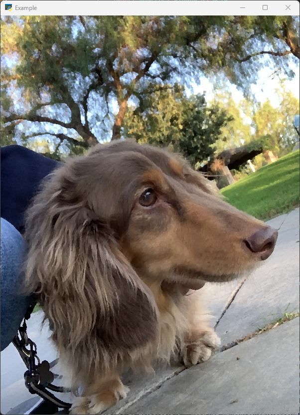
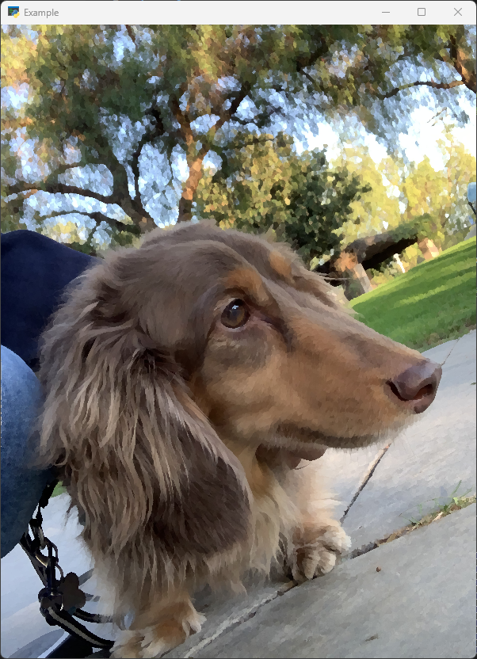
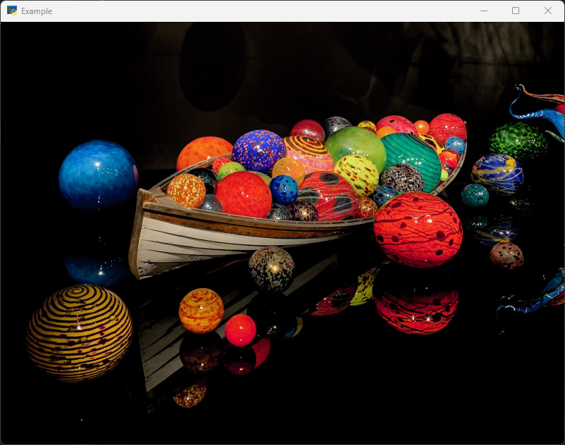
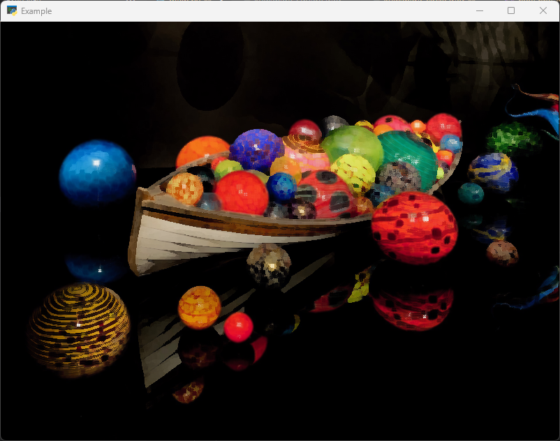
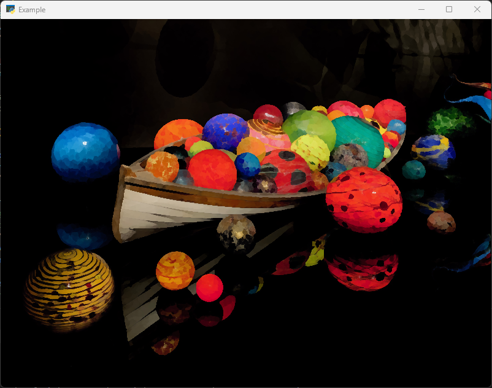

# Project Milestone Report
{: .no_toc }

## Table of Contents
{: .no_toc .text-delta }

- TOC
  {:toc}

## Progress Summary

To incorporate our filter ideas into the graphics pipeline, we decided to first bind the input image as a texture input to the shader program, and then do all of our filtering color computations in the fragment shader. We decided to set up our program in python, using the `moderngl` and `moderngl-window` packages to execute our shader program and render outputs.

Setting up the project boilerplate and learning how to use the packages took a fair amount of time, but we were able to fully implement both the square and circle variants of the Kuwahara. Our remaining goals remain the same as before - implementing the anisotropic variant of the Kuwahara filter and also the Voronoi filters. We also have a new stretch goal, which is to implement a functioning GUI that allows the user to toggle between different kernel sizes so they can visualize the filters in action.

### Image Outputs

The images below were all rendered with a filter kernel size of 10.

Jay's Pet Dachshund Coco

    <table style="width: 100%">
        <tr>
            <td>
                

                    <figure>
                        
                        <figcaption>Original</figcaption>
                    </figure>
                

            </td>
            <td>
                

                    <figure>
                        
                        <figcaption>Square</figcaption>
                    </figure>
                

            </td>
        </tr>
         
        <tr>
            <td>
                

                    <figure>
                        
                        <figcaption>Circle</figcaption>
                    </figure>
                

            </td>
        </tr>
         
    </table>

Boat from the Seattle Chihuly Garden and Glass Exhibit

    <table style="width: 100%">
        <tr>
            <td>
                

                    <figure>
                        
                        <figcaption>Original</figcaption>
                    </figure>
                

            </td>
            <td>
                

                    <figure>
                        
                        <figcaption>Square</figcaption>
                    </figure>
                

            </td>
        </tr>
         
        <tr>
            <td>
                

                    <figure>
                        
                        <figcaption>Circle</figcaption>
                    </figure>
                

            </td>
        </tr>
         
    </table>

### Notable Observations

## Video

Video Link Here

## Presentation

Presentation Link Here
