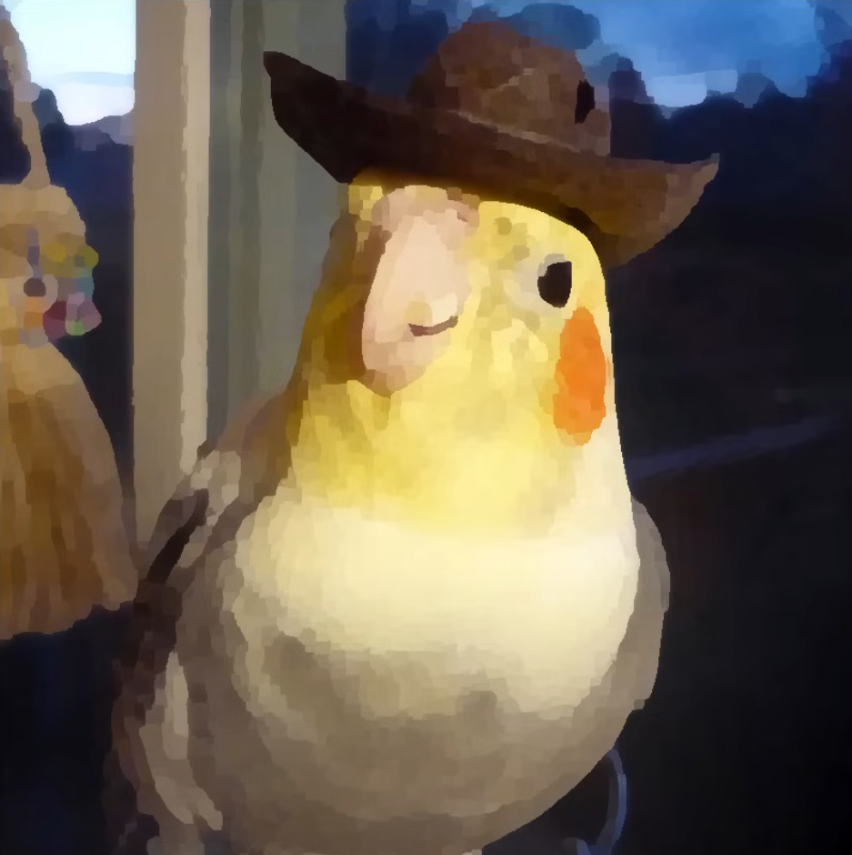
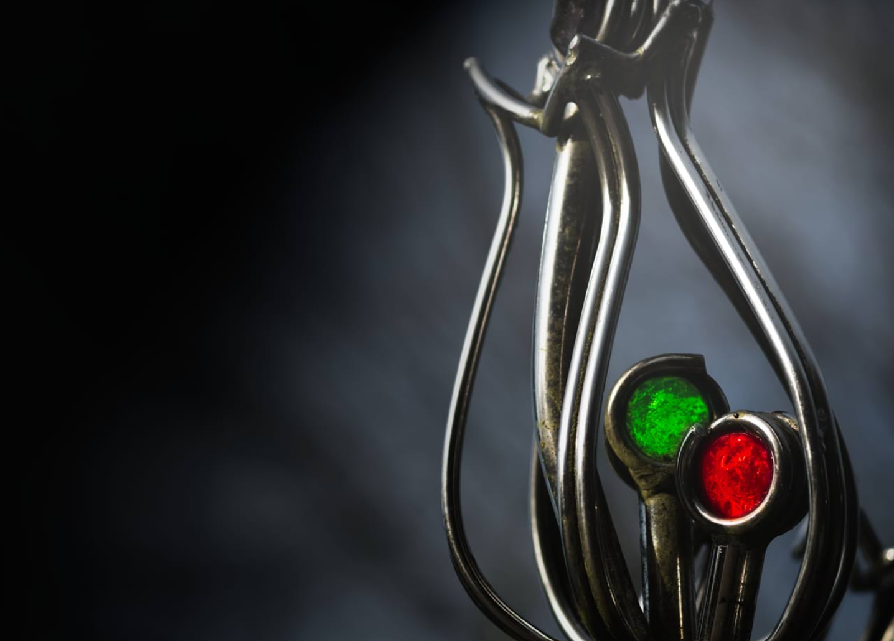
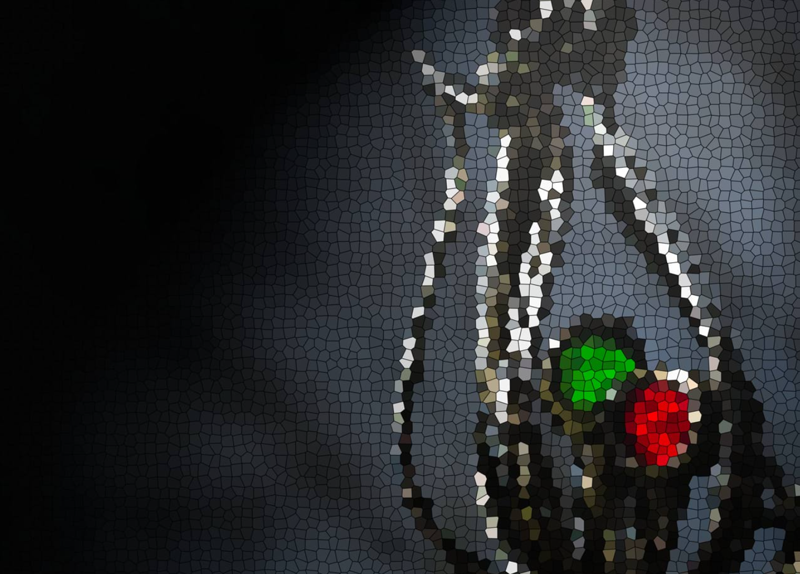

# Project Proposal
{: .no_toc }

## Table of contents
{: .no_toc .text-delta }

-   TOC
{:toc}

# Creating Painterly Renderings Using Different Filter Techniques
{: .no_toc }

By: Jonathan Wang, Ayra Jafri, Jay Ni, and Vanessa Qiu

## Summary

Given an input image, we will create an artistic, non-realistic rendering by applying the Kuwahara and Voronoi filters. We will compare the output quality between different implementations of these aforementioned filters and try to qualitatively determine which produce the best results.

## Problem Description

For our final project, we wish to address the issue of rendering images and scenes in a painterly style without having to manually paint over models and/or scenes, and allow for this rendering to be at the very end of the rendering pipeline. In the production of 2.5D-styled shows and movies such as Arcane, Spider-Verse, and TMNT: Mutant Mayhem, a decent amount of the painterly effects achieved are done so by the methods mentioned above, and although these look incredibly charming, they are also very time-consuming and resource-intensive, both when rendering scenes and for artists and animators as well. Thus, we wish to address this by applying post-processing filters on rendered scenes to provide a quick-and-easy painterly effect. This will be done by implementing two (potentially three, if time permits) post-processing filters: the Kuwahara and Voronoi filters (and potentially a cel-shading filter).

## Goals and Deliverables

For our project, we plan to create a program that can take an input image, apply the Kuwahara filter and/or Voronoi filter to the image depending on what is specified, and output the result. We plan to have three different implementations of the Kuwahara filter: the square, circle, and anisotropic implementations, and the user will be able to specify which implementation of the Kuwahara filter they want applied. Shown below are some images that demonstrate what each filter and specific implementation should look like (the Kuwahara images are taken from Acerola’s YouTube video on Kuwahara filtering; the Voronoi images are taken from Affinity’s webpage on Voronoi filtering).

For the Kuwahara images, the first image shows the original image of a bird with a cowboy hat. The next three images show square Kuwahara filtering, circle Kuwahara filtering, and anisotropic filtering applied on the original image, respectively.

    <table style="width: 100%">
        <tr>
            <td>
                

                    <figure>
                        
                        <figcaption>Original</figcaption>
                    </figure>
                

            </td>
            <td>
                

                    <figure>
                        
                        <figcaption>Square</figcaption>
                    </figure>
                

            </td>
        </tr>
         
        <tr>
            <td>
                

                    <figure>
                        
                        <figcaption>Circle</figcaption>
                    </figure>
                

            </td>
            <td>
                

                    <figure>
                        
                        <figcaption>Anisotropic</figcaption>
                    </figure>
                

            </td>
        </tr>
         
    </table>

For the Voronoi images, the first image shows some sort of metal ornament, and the next image shows the same image but with the Voronoi filter applied. With our program, we hope to achieve these images.

    <table style="width: 100%">
        <tr>
            <td>
                

                    <figure>
                        
                        <figcaption>Original</figcaption>
                    </figure>
                

            </td>
            <td>
                

                    <figure>
                        
                        <figcaption>Square</figcaption>
                    </figure>
                

            </td>
        </tr>
         
    </table>

In order to test the functionality of our program, we will first apply the filters on the above bird image and metal ornament image and compare our program’s outputs to the above expected filtered images. These will serve as baseline tests to see if our filters are functioning as we expect. Then we will pass in additional images to each of the filters and compare our program’s outputs to the expected filtered images. Some examples of additional images we will pass in and compare our output against are shown below. In addition to testing the functionality of our program, we will also test the performance of our program by recording the runtime of each of our filters. There are no exact runtimes we want our filters to achieve. We mainly just want to make sure that all of our filters can process the inputted images in a reasonable amount of time and that the runtimes of the three different Kuwahara implementations make sense, meaning that anisotropic takes longer than circle and circle takes longer than square. We effectively plan to compare the runtimes/performance of applying the filters with the quality of the results outputted. The quality will ultimately be subjective, but we plan to compare the “painterliness” of the results by inspecting how the filters treat edges, detailed regions, color blending, etc.

## Schedule

### Week 1

Implement the Kuwahara filter, including the square, circle, and anisotrophic variants.

### Week 2

Implement the Voronoi filter with Delauney triangulation, including the Euclidean, Manhattan, and Chebyshev distance metrics. Test out effectiveness of layering the Kuwahara filter.

### Week 3

Buffer week to finish up leftover work from previous two weeks. If time allows, implement cel-shading.

### Week 4

Work on the final project deliverables, including webpage, presentation, and image samples. Assuming we are still working on a non-interactive program at this point, create a command line program that allows the user to input images to generate output images.

## Resources

-   Kuwahara filters:
    -   <https://www.researchgate.net/publication/334689545_Oil_Painting_Style_Rendering_Based_on_Kuwahara_Filter>
    -   <https://diglib.eg.org/bitstream/handle/10.2312/LocalChapterEvents.TPCG.TPCG10.025-030/025-030.pdf?sequence=1&isAllowed=y>
    -   <https://www.kyprianidis.com/p/npar2011/jkyprian-npar2011.pdf>
    -   <https://link.springer.com/article/10.1007/s11760-015-0791-3>
    -   <https://www.youtube.com/watch?v=LDhN-JK3U9g&ab_channel=Acerola >
-   Painterly rendering:
    -   <https://ieeexplore.ieee.org/stamp/stamp.jsp?tp=&arnumber=9106365>
    -   <https://onlinelibrary.wiley.com/doi/full/10.1002/cav.1435>
    -   <https://hal.science/hal-01342483/document>
    -   <https://onlinelibrary.wiley.com/doi/full/10.1002/cav.1435>
-   Voronoi filters:
    -   <https://www.cs.jhu.edu/~misha/Fall05/Papers/amenta99.pdf>
    -   <https://sarielhp.org/research/CG/applets/Crust/Crust.html>
    -   <https://www.cs.ubc.ca/%7Esheffa/dgp/ppts/crust.pdf>
    -   <https://www.cs.ucdavis.edu/%7Eamenta/pubs/crust.pdf>
    -   <https://affinity.help/photo/en-US.lproj/index.html?page=pages/Filters/filter_voronoi.html&title=Voronoi >
    -   <https://thebookofshaders.com/12/>
-   Cel-Shading:
    -   <https://raulreyesfinalproject.files.wordpress.com/2012/12/dissertation_cell-shading-raul_reyes_luque.pdf>
-   Misc (if we need to use an alternate framework):
    -   <https://pbr-book.org/4ed/contents>
